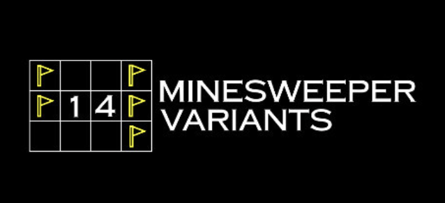
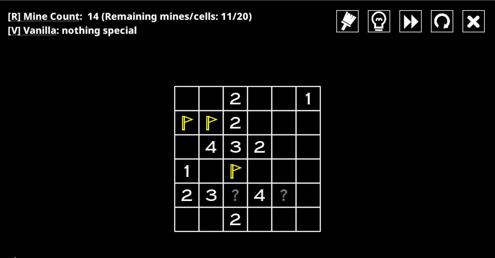
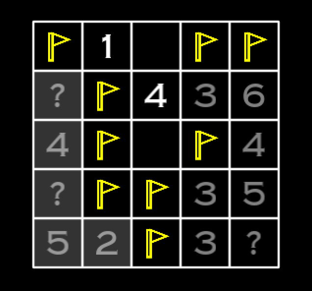
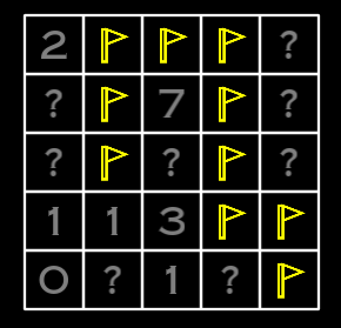
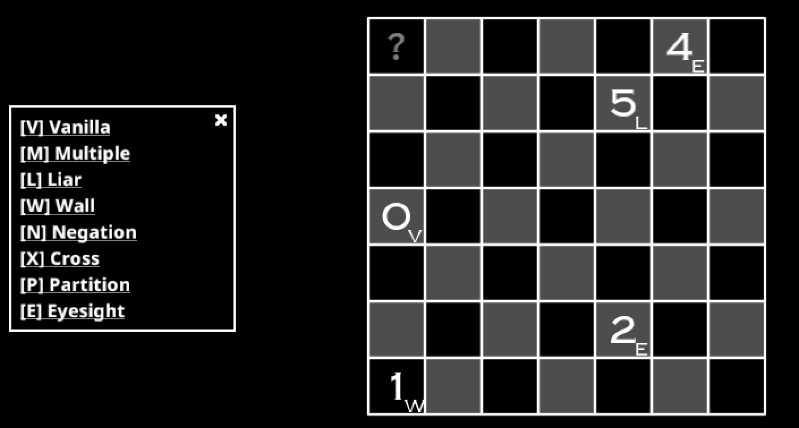

Recently, I've been playing many puzzle games. I'd like to talk about the different types of puzzle games that might exist some other time, but 14 Minesweeper Variants is a bit different than what I typically play. I've never been a huge fan of Minesweeper, and only played the google version when bored at school. I was still intrigued when I came across this game on steam for $6 CAD. My experience of "variants" of popular puzzles like sudoku was quite positive.I generally found that they made these games a lot more interesting, giving new creative ways to think about the puzzle. 

I've beaten the main portion of the game, and I can confidently say that this is the best "variant" collection of any puzzle I have ever played. Almost all the variants felt like they brought new challenges to think about. Outside of the variants, there were some additions to the minesweeper experience that made this game feel magical to play. 

# Non Variant Stuff

The game does not allow guessing. It's not that you never need to guess, it's that the game will fail you if you ever make a move that can't be guaranteed to be true. What this means is that every cell you open and every mine you flag requires you to fully understand the board. 

The boards are also not randomly generated as you play. There are a set number of puzzles that were generated that the creator has somehow curated. There were many levels that almost felt like they had their own unique identity, something that doesn't tend to happen with generated puzzles like normal minesweeper. What this does mean is that if you fail a level, you can just retry it. However, because you can't guess, you not only have to remember the old board but the order in which to reveal cells and flag mines. This becomes tedious enough especially in larger boards that failing still feels like a real punishment, and you can't continously randomly guess until the game lets you through.

The board size is also much smaller. It starts at 5x5 and caps out at 8x8. This is small, but with the more "intentional" puzzle design and the ban on guessing, I think the sizes are perfect. Another factor is that there are way fewer empty squares that don't border any mines, and some clues are question marks. 

Question marks are like normal clues, except that they are not clues. They are not the same as a cell with 0 neighboring mines, they are a cell that gives you no information at all. These cells are what make this game feel so rewarding to play. The amount of clues you are given is limited, and the game forces you to squeeze a lot more out of the ones you are given. 

# Variants

The 14 variants are split into two categories. Some affect the meaning of the clues, and others restrict how mines can be placed, 7 each. They generally don't tend to warp the entire game, but just add a lot more to think about. 

One of my favourite clue changing variants is "Liar". The clues are always either one too high or one too low. For example, if a cell says there are 3 mines nearby, there actually are either 2 or 4. What I love about this variant is how dynamic it feels, and how figuring out which way the clues swing becomes it's own little thing to think about. Another one I really liked was "Eyesight". This is probably the most strange of the variants. The number now represents how many cells can be "seen" orthogonally without being stopped by a mine, including itself. 

the 5 can "see" 5 cells here

Some of the mine changing rules are pretty cool too, and while I initially didn't like them as much, The more I played the more I appreciated how they changed the game. One example is "Triplet" where mines can't be placed 3 in a row orthogonally or diagonally. At first, this rule sounded quite boring, but there were so many cases where the problems you had to solve using it were so interesting. I thought "Snake" was also really interesting. The mines have to make a snake that doesn't touch itself. The information you get is generally quite restricted, so counting mines and determining how long the snake is was often necessary, which I enjoyed.

snake!!!!!

While these variants were cool on their own, the endgame has you mixing them up in 2 different ways. One mixes up all of the clue changing variants, so that the board has many different variants all at once. 

Another one takes a mine restricting rule and a clue changing rule and mashes them together. This leads to 49 different combinations of variants!

Finally, these two mixes get mixed together, where a mine restricting rule and all of the clue changing rules are thrown together. The combination of so many variants is dizzying, and really fun to think about. The creativity and depth of the variants really shine through. 

I'm not even close to done with minesweeper variants. There is a whole second other game with 14 new variants I have not tried yet, and even the first game has a lot of content I have not seen yet. If you are a fan of puzzle games, whether it be more classic ones like sudoku or more modern ones like Baba is You, I strongly recommend this game. 