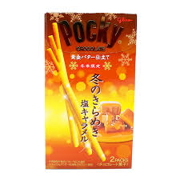

Pocky is probably my favourite snack. There are many different variaties of pocky, and even different offbrand versions of pocky, and I decided to attempt to try as many as I could. There is such a large breadth, that I'm of course missing many, but I will attempt to catagorize the ones I have had as best I can. 

# BEST

bestjdsakshfajdks

Salty Caramel Pocky are the best pocky. I can't explain why. They are usually winter exclusive, so during the past winter season, I've almost bought one every week. I have a pile of boxes. 

# Very Good

Crunchy Strawberry, Double Chocolate, Double Vanilla, Thin, Dark Chocolate, Cocoa powder Chocolate, Double White Strawberry, Crunchy Almond

# Good

 Strawberry, Chocolate, Cookies and Cream, Green Tea, Big Single Strawberry, Big Single Grape, Sakura Green Tea, Small Short Chocolate, 

# ok

Yogurt Peach, Yogurt Blueberry, Chocolate Banana, Double Green Tea Ice Cream, Big Single Orange, Mango, 

# eh...

Cocoa Nibs, Blueberry, Cheesecake, 5 Red Treasures, 5 Black Treasures, Pistachio(allergy)

# Offbrand

Pepero is not bad, I would say most pepero flavours are similarly good and go in the middle of the good tier. Strawberry is notably worse than pocky strawberry though. 

Pretz and Pejoy are both glico products, and I would say both are pretty good. Maybe seperate pretz ranking in future. 

Lucky Stick by Meiji is pretty bad, weird that it exists. Pocky is still pocky though, and as long as the flavours dont get too weird its hard to make it unappealing. 

