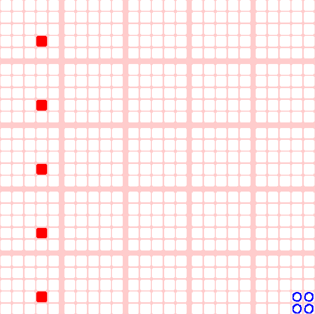
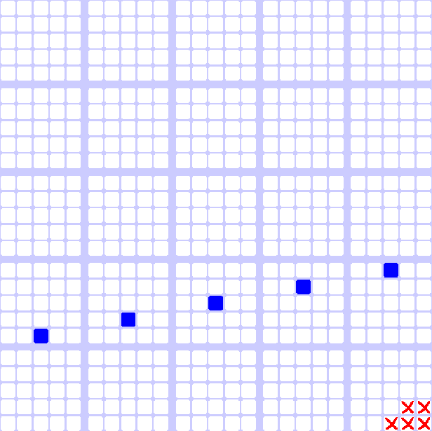
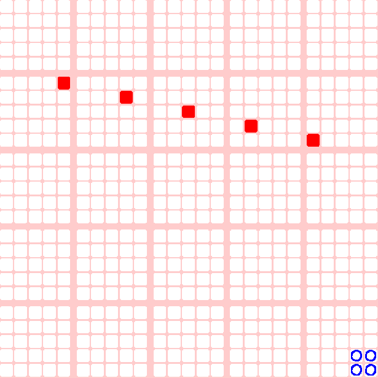

In my first class of Linear Algebra, My professor showed us how Tic Tac Toe worked in 3 dimensions, forced us to play a game, then explained how it could 
even extend to 4D and how he played 4D tic tac toe with his friends during lectures when he was studying. 

I was very intrigued, so I decided to try to make it so I could play with friends online! 

you can try yourself <a href = "https://applesarebad.itch.io/5x5x5x5-4d-tic-tac-toe" target = "blank">here</a>, although you need to download it to play online. 

The premise is its 5x5x5x5, but represented with a 2d grid of 2d boards.  

the way displayed the 4 dimensions are:
- x: going left/right on the same small 5x5 board
- y: going up/down on the same small 5x5 board
- z: going left/right on the big grid of 5x5 boards, while remaining on the same square in the small 5x5 board
- w: going up/down on the big grid of 5x5 boards, while remaining on the same square in the small 5x5 board

and the direction of the line would be 1,0, or -1 in each dimension

if you can make a line of 5 with each step going the same direction, you win!

Here are some examples. Its hard to wrap your head around at first. 

Winning in w direction (all 5x5 boards in the column are marked at the same spot)

Winning in y and z direction (when z goes right, y goes up)

Winning in x, y, and z direction (when z goes right, x and y go left and down)

I challenged myself to complete this project over one weekend and I ended up finishing most of it by the end of sunday, so I'm quite proud I was able to turn an idea into reality so quick! The game was made using Godot, and I've wanted to practice using it during university. 