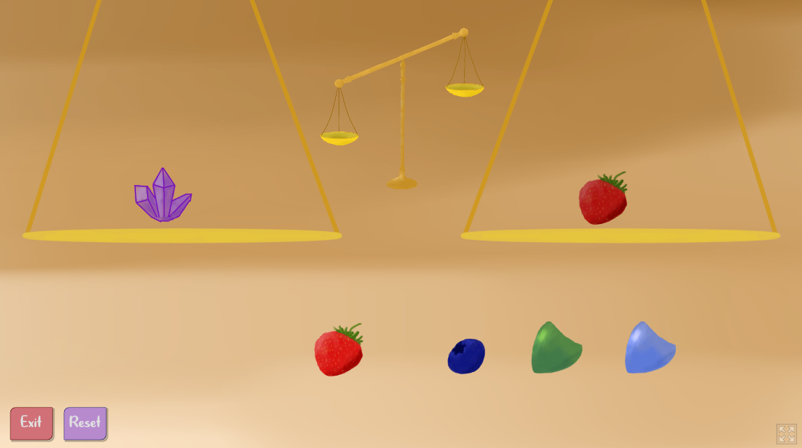
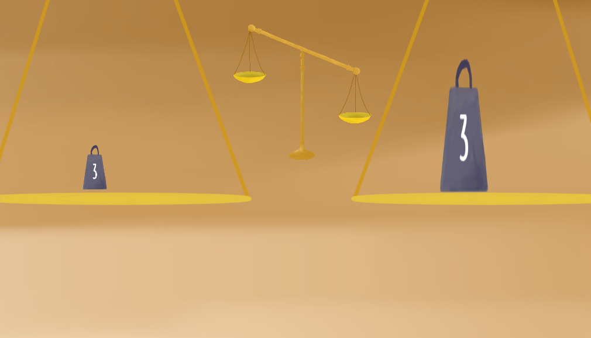

I used to watch a lot of videos about game design. As I started to get more familiar with coding, I decided I would try to participate in a game jam!

The GMTK game jam was one of the largest ones, and I had seen other videos on previous years' interations, so I decided to join the 2024 GMTK game jam. 

# 2024 GMTK 
<a href = "https://applesarebad.itch.io/balance ">Find it here</a>

The theme of the jam was "Built to Scale".  
When I saw this, my mind moved to the idea of a literal scale that weighs things, so I decided to make a puzzle game about balancing a scale. I also wanted to connect to the theme better, so I came up with the idea of "fish scales" that could "scale" the dimensions of the objects you put on the "scale".

While it was supposed to be 96 hours, I was busy for the last 2 days of the jam so I only had 48 hours. Since this was my first experience being under such time pressure, I planned to scale back in scope and make only 10 levels, and if I had other ideas I could scale up later. 

I also did all the art myself. I have painting experience but drawing things digitally was also very challenging for me. The programming ended up actually being the easiest part, as I had practiced using Godot a little before hand, so it was the only thing I had meaningful experience in. My game also happened to have more of the difficulty in designing the levels rather than implementing them. 

Here are some screenshots

some weights and some scales

scaled up weights using fish scales

I didn't expect anyone to end up seeing my game, but because of how the jam was ran, it actually reached some people. I got some really kind comments and I think those comments were part of my motivation to continue to try making things.

# 2025 GMTK
<a href = "https://applesarebad.itch.io/rock-paper-scissors-jump">Find it here</a>

The theme of this jam was "Loop"
I was really lost when I saw this theme. There are so many ways to interpret it. I had recently been strangely obsessed with Rock Paper Scissors, and that feels pretty loop related so I decided to explore that route. I also wanted to try making a platformer, as I had recently been messing around with them in Godot, so I settled on a Rock Paper Scissors platformer where you "loop" through rock paper and scissors forms to use their special abilities, which include a ground pound, a double jump, and a dash respectively. 

I had the full 96 hours this time, so I had a lot more time to polish things, and I even had time to make some small animations.

I My game also placed in the top 25% in most of the categories of the jam! I would have been proud regardless because I really liked the final result, but it felt very validating to see others liked my game too. 