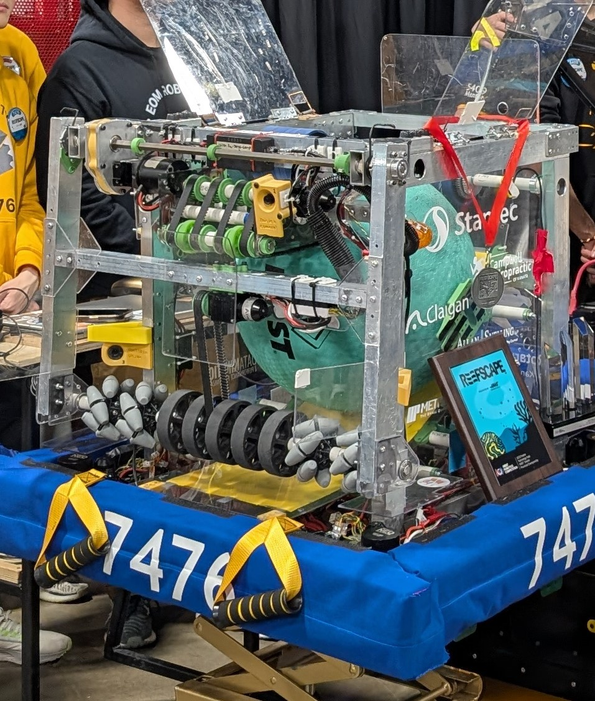

Robotics was the extra curricular I spent the most time on in highschool, and it was a really great experience for me. 
I joined FRC 7476 in grade 11, and had a really good time. I knew I wanted to participate again the next year, and I knew I wouldn't have regretted any time spent at all.
It just so happens our 2025 season was quite successful! 

For those unaware, FRC is a competition for highschool students to compete in a yearly game with robots.  
<a href = "https://www.youtube.com/watch?v=YWbxcjlY9JY" target = blank> See 2025s game here </a>

One of the things that made our robot stand out was the fact that our strategy was very unconventional.  
"Coral" was deemed by most to be the better game piece to score with, but we decided to try and fill a niche and supportive role by ONLY touching "algae". 
By focusing on one thing, we knew we would be able to get much better a something few teams focused on, which would help us stand out.

 Our robot, SpongeBot SquareFrame!

I mostly ended up doing Hardware and Strategy related tasks 
Some of the things I worked on were our swerve modules, gearboxes, and some other small accessories. I also assisted with outreach events a few times. 

One of the things I did for strategy was our team's <a href = "https://docs.google.com/spreadsheets/d/1NUG_EREif5dfzVEu0yUu4f89Yx2gPd80Dd21olcY3_o/edit?usp=sharing" target = blank>scouting spreadsheet</a>

Many teams "scout" other teams to see their strengths and weaknesses.

I wanted to remove as much friction as possible for those filling in the spreadsheet, so I tried really hard to all my formulas work regardless of where they were and who they were searching for. In the end, the spreadsheet ended up surviving over 2400 matches of data! I also worked a lot on alliance selection and used the data to make a plan for any permutations of events. 

Overall, at all 3 competitions, we were all really happy with our results in general!  
we placed higher than we expected at all of our events and

At <a href =' https://frc-events.firstinspires.org/2025/ONWEL' target = blank>Niagara</a>, we got the Innovation in Control Award!  
At <a href =' https://frc-events.firstinspires.org/2025/ONNOB' target = blank>North Bay</a>, we got the Creativity Award!  
At <a href = 'https://frc-events.firstinspires.org/2025/ONCMP2' target = blank>Provincials</a>, we were second pick of Alliance 2 and ended up being District Championship Finalists!
 
One of our teachers also won the Woodie Flowers Award! 

I really appreciate my teachers/mentors a lot. They have contributed a lot to who I am today and have been so incredible and worked so hard to help our team. I also really appreciate my teammates for being so talented and fun to be around. 