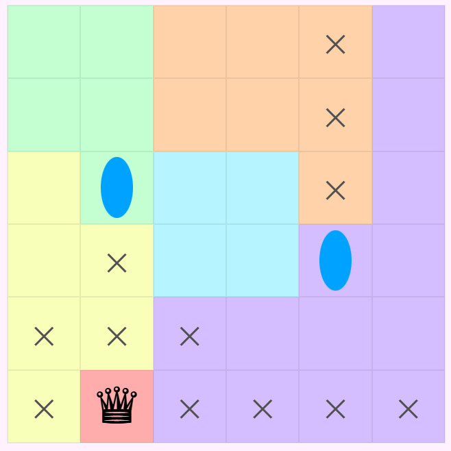

I have been consistently playing LinkedIn games for the past few months... The leaderboard showing my time compared to others is very motivating.
My top 3 are probably patches, zip, and of course queens. 

In fact, I enjoyed queens so much that I decided I wanted to try to make my own queens puzzles. And I had been playing lots of sudoku variants recently as well, so I decided my next project would be my take on queens variants. 

Check them out <a href = "https://queensvariants.andrew-zhang.ca"> here! </a>

### Mirrors

The first variant I created is mirrors, where "mirrored" regions needed to match. I came up with this idea because I thought it would be interesting to see how the requirement could limit where you could place your queens. Coming up with interesting puzzles was quite challenging though. It took me a really long time to create something that wasn't too easy, but also able to be followed with no guessing. In the end I think it landed on the harder side.

### Portals

Next was portals! Queens' line of sight follows through portals, but they can't see past portals. I thought it would be cool to mess with how their line of sight functioned, and it also allows for 2 queens to be in the same row or column!

I had to rewrite how I checked their line of sight, as I used to just check for the region and matching rows/columns. Now I had to follow their line of sight manually. 

I hope to add more in the future!

