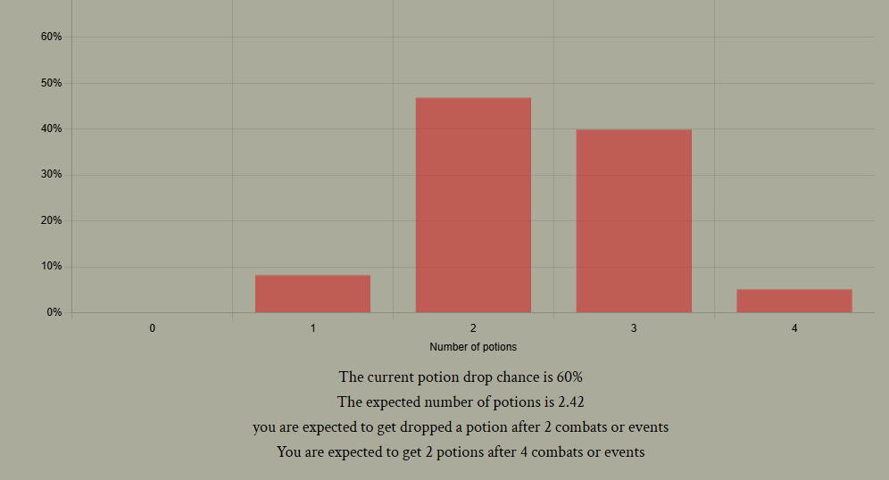

Slay the Spire has been one of my favourite games ever since I played it. One of the mechanics that becomes more important as you get better at the game is potions. 
Using them correctly is very important. However, there is some randomness to them, as they only sometimes drop. 

It starts at a 40% chance per combat, and increases by 10% if nothing drops but decreases by 10% if a potion does drop. 
There are a few additional elements such as "events" sometimes containing a combat that could drop potions too. 

The calculations for expected value get complicated quite quickly, and knowing how many potions you'll get before a scary boss or elite enemy is crucial for deciding which route to take in the game. 

I decided to make a calculator that displays the distribution of the number of potions you are expected to get before that scary combat! It also displays the expected trials until success for your first however many potions, and the overall expected value. 

 potion distribution graph and additional info

Users input their past and future floors, and then 
the distribution is calculated using a recursive branching algorithm that looks at all possible outcomes and combines them together. It also finds the expected value at the same time. The data is then displayed using Chart.js.

